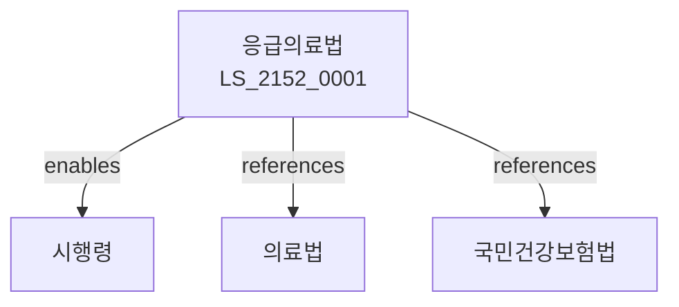

# 응급의료법

> [법률 제20212호, 2024. 1. 9., 일부개정]

---

---

## 제1장 총칙
### 제1조 (목적)
이 법은 응급의료에 관한 사항을 정함으로써 국민의 생명을 보호하고 응급의료체계를 확립함을 목적으로 한다。

### 제2조 (정의)
이 법에서 사용하는 용어의 뜻은 다음과 같다。
1. "응급의료"란 응급환자에 대한 의료를 말한다。
2. "응급환자"란 응급한 처치를 필요로 하는 환자를 말한다。
3. "응급의료기관"란 응급의료를 제공하는 기관을 말한다。
4. "응급구조사"란 응급구조를 하는 자를 말한다。

---

## 제2장 응급의료기관
### 第5条(응급의료기관)
응급의료기관을 지정한다。
### 第6条(지정기준)
지정기준을 정한다。
### 第7条(운영)
응급의료기관을 운영한다。
### 第8条(지정취소)
지정을 취소할 수 있다。

---

## 제3장 응급의료
### 第15条(응급진료)
응급진료를 실시한다。
### 第16条(응급처치)
응급처치를 한다。
### 第17条(이송)
환자를 이송한다。
### 第18条(진료거부금지)
진료거부를 금지한다。

---

## 제4장 응급구조
### 第25条(응급구조)
응급구조를 실시한다。
### 第26条(응급구조사)
응급구조사가 될 수 있다。
### 第27条(자격)
응급구조사자격을 정한다。
### 第28条(구조활동)
구조활동을 한다。

---

## 제5장 응급의료정보
### 第35条(정보체계)
응급의료정보체계를 구축한다。
### 第36条(정보제공)
정보를 제공한다。
### 第37条(신고)
응급환자를 신고할 수 있다。
### 第38条(상담)
응급상담을 제공한다。

---

## 제6장 감독
### 第42条(감독)
보건복지부장관은 응급의료사업을 감독한다。
### 第43条(보고 및 검사)
필요한 경우 보고를 명하거나 검사할 수 있다。
### 第44条(시정명령)
위법한 사항에 대하여는 시정을 명할 수 있다。
### 第45条(지정취소)
중대한 위반사유가 있는 경우 지정을 취소할 수 있다。

---

## 제7장 벌칙
### 第52条(벌칙)
다음 각 호의 어느 하나에 해당하는 자는 3년 이하의 징역 또는 3천만원 이하의 벌금에 처한다。

1. 진료를 거부한 자
2. 허위로 응급구조를 한 자
### 第53条(과태료)
다음 각 호의 어느 하나에 해당하는 자에게는 2천만원 이하의 과태료를 부과한다。

1. 보고를 하지 아니한 자
2. 검사를 거부한 자

---

## 관계 그래프

**상위 법령**
- [[헌법]] 제36조 (국민의 건강)
- [[의료법]]

**관련 법령**
- [[국민건강보험법]]
- [[감염병예방법]]
- [[119구조법]]
- [소방기본법]]

**하위 법령**
- [[응급의료법 시행령]]
