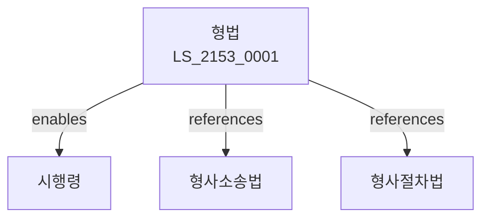

# 형법

> [법률 제20213호, 2024. 1. 9., 일부개정]

---

---

## 제1장 총칙
### 제1조 (목적)
이 법은 범죄와 형벌에 관한 사항을 정함으로써 국가의 질서를 유지하고 국민의 자유와 권리를 보호함을 목적으로 한다。

### 제2조 (죄의 성립)
범죄는 구성요건에 해당하는 행위가 있어야 성립한다。

### 제3조 (형벌의 종류)
형벌의 종류는 다음과 같다.
1. 사형
2. 징역
3. 금고
4. 자격상실
5. 자격정지
6. 벌금
7. 구류
8. 과료
9. 몰수

---

## 제2장 죄
### 第8条(죄의 종류)
죄는 중죄ㆍ경죄로 구분한다。
### 第9条(미수)
미수범은 처벌한다。
### 第10条(공범)
공동정범은 처벌한다.
### 第11条(교사)
교사범은 처벌한다.
### 第12条(방조)
방조범은 처벌한다.

---

## 제3장 형
### 第15条(징역)
징역은 1월 이상으로 한다。
### 第16条(금고)
금고는 1월 이상으로 한다。
### 第17条(자격상실)
자격상실은 공무원 자격을 박탈한다。
### 第18条(자격정지)
자격정지는 1년 이상 15년 이하로 한다。

---

## 제4장 인명죄
### 第25条(살인)
사람을 살해한 자는 사형 또는 무기징역에 처한다。
### 第26条(상해)
사람을 상해한 자는 7년 이하의 징역에 처한다。
### 第27条(폭행)
사람을 폭행한 자는 2년 이하의 징역에 처한다。
### 第28条(과실치사)
과실로 사람을 사망하게 한 자는 3년 이하의 징역에 처한다。

---

## 제5장 재산죄
### 第35条(절도)
타인의 재물을 절취한 자는 6년 이하의 징역에 처한다。
### 第36条(강도)
폭행으로 재물을 취득한 자는 3년 이상의 징역에 처한다。
### 第37条(사기)
기망으로 재물을 취득한 자는 10년 이하의 징역에 처한다。
### 第38条(횡령)
타인의 재물을 횡령한 자는 5년 이하의 징역에 처한다。

---

## 제6장 공공안전죄
### 第45条(방화)
건조물을 소훼한 자는 무기징역에 처한다。
### 第46条(실화)
과실로 화재를 낸 자는 3년 이하의 징역에 처한다。
### 第47条(교통방해)
교통을 방해한 자는 10년 이하의 징역에 처한다。
### 第48条(주거침입)
타인의 주거에 침입한 자는 3년 이하의 징역에 처한다。

---

## 제7장 풍속죄
### 第52条(간음)
강간한 자는 3년 이상의 징역에 처한다。
### 第53条(강제추행)
강제로 추행한 자는 10년 이하의 징역에 처한다。
### 第54条(공연음란)
공연히 음란한 행위를 한 자는 1년 이하의 징역에 처한다。
### 第55条(음화반포)
음란한 물건을 반포한 자는 1년 이하의 징역에 처한다.

---

## 관계 그래프

**상위 법령**
- [[헌법]] 제12조 (범죄와 형벌)

**관련 법령**
- [[형사소송법]]
- [[형사절차법]]
- [[소년법]]
- [[특정범죄가중처벌법]]

**하위 법령**
- [[형법 시행령]]
