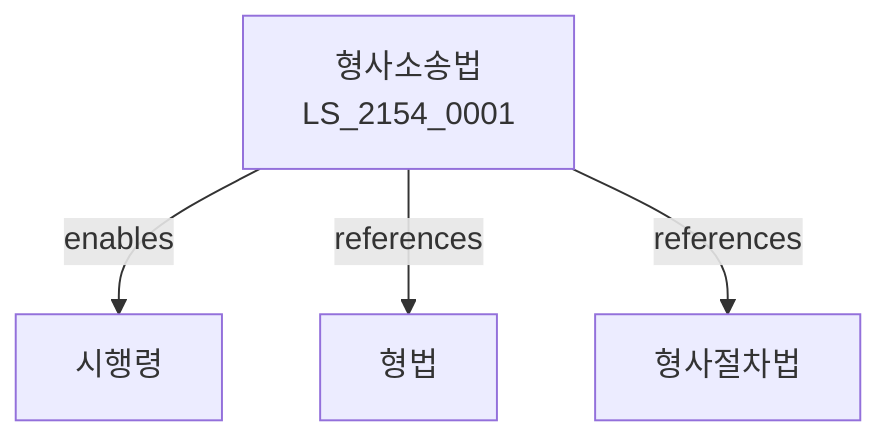

# 형사소송법

> [법률 제20214호, 2024. 1. 9., 일부개정]

---

---

## 제1장 총칙
### 제1조 (목적)
이 법은 형사사건에 관한 소송절차를 정함으로써 형사사법의 정의를 실현함을 목적으로 한다.

### 제2조 (소송조건)
공소제기에는 소송조건이 필요하다.
1. 법원의 관할
2. 소추권의 존재
3. 공소시효의 완성 여부

### 제3조 (법원의 관할)
법원은 사건의 성질에 따라 관할을 정한다.

---

## 제2장 수사
### 第5条(수사기관)
수사는 검사가 주관한다.
### 第6条(사법경찰)
사법경찰관은 검사의 지휘를 받는다。
### 第7条(수사의 단서)
수사의 단서는 고소ㆍ고발 등이다。
### 第8条(임의수사)
임의수사를 할 수 있다。
### 第9条(강제수사)
강제수사는 영장에 의한다。

---

## 제3장 강제처분
### 第15条(체포)
체포는 영장에 의한다。
### 第16条(구속)
구속은 영장에 의한다。
### 第17条(압수수색)
압수ㆍ수색은 영장에 의한다。
### 第18条(영장주의)
영장은 법관이 발부한다。

---

## 제4장 공소
### 第25条(공소제기)
검사는 공소를 제기한다。
### 第26条(공소장)
공소장을 제출한다。
### 第27条(공소시효)
공소시효는 완성한다。
### 第28条(공소취소)
공소를 취소할 수 있다。

---

## 제5장 공판
### 第35条(공판절차)
공판절차를 진행한다。
### 第36条(공판기일)
공판기일을 지정한다。
### 第37条(증거조사)
증거조사를 실시한다。
### 第38条(변론)
변론을 종결한다。

---

## 제6장 증거
### 第42条(증거능력)
증거능력을 인정한다。
### 第43条(증명력)
증명력을 판단한다。
### 第44条(전문법칙)
전문증거는 증거능력이 없다。
### 第45条(위법수집증거)
위법하게 수집한 증거는 증거능력이 없다。

---

## 제7장 재판
### 第52条(유죄판결)
유죄판결을 선고한다。
### 第53条(무죄판결)
무죄판결을 선고한다。
### 第54条(관할위반)
관할위반판결을 선고한다。
### 第55条(공소기각)
공소기각판결을 선고한다。

---

## 제8장 상소
### 第62条(항소)
항소할 수 있다。
### 第63条(상고)
상고할 수 있다。
### 第64条(항고)
항고할 수 있다。
### 第65条(재항고)
재항고할 수 있다。

---

## 제9장 확정
### 第72条(확정력)
판결은 확정력을 가진다。
### 第73条(집행력)
확정판결은 집행력을 가진다。
### 第74条(형집행)
형을 집행한다。
### 第75条(형면제)
형면제사건을 처리한다。

---

## 관계 그래프

**상위 법령**
- [[헌법]] 제27조 (재판청구권)
- [[형법]]

**관련 법령**
- [[형사절차법]]
- [[소년법]]
- [[군사법원법]]
- [[특허법원법]]

**하위 법령**
- [[형사소송법 시행령]]
