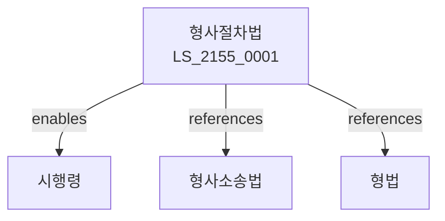

# 형사절차법

> [법률 제20215호, 2024. 1. 9., 일부개정]

---

---

## 제1장 총칙
### 제1조 (목적)
이 법은 형사절차에 관한 특례를 정함으로써 형사사법의 공정성과 효율성을 확보함을 목적으로 한다。

### 제2조 (정의)
이 법에서 사용하는 용어의 뜻은 다음과 같다.
1. "형사절차"란 수사ㆍ재판 등을 말한다.
2. "피의자"란 범죄의 혐의를 받는 자를 말한다.
3. "피고인"란 재판을 받는 자를 말한다.
4. "참고인"란 증언을 하는 자를 말한다.

---

## 제2장 수사절차
### 第5条(수사개시)
수사를 개시한다。
### 第6条(피의자조사)
피의자를 조사한다。
### 第7条(참고인조사)
참고인을 조사한다。
### 第8条(압수수색)
압수수색을 실시한다。

---

## 제3장 변호
### 第15条(변호인)
변호인을 선임할 수 있다。
### 第16条(국선변호)
국선변호인을 선정할 수 있다。
### 第17条(변호권)
변호인의 권리를 정한다。
### 第18条(변호의무)
변호인의 의무를 정한다。

---

## 제4장 보석
### 第25条(보석)
보석을 청구할 수 있다。
### 第26条(보석허가)
보석을 허가할 수 있다。
### 第27条(보석조건)
보석조건을 정한다。
### 第28条(보석취소)
보석을 취소할 수 있다。

---

## 제5장 간이공판
### 第35条(간이공판)
간이공판절차를 진행할 수 있다。
### 第36条(적용대상)
적용대상을 정한다。
### 第37条(절차)
간이공판절차를 정한다。
### 第38条(판결)
간이공판판결을 선고한다。

---

## 제6장 약식명령
### 第42条(약식명령)
약식명령을 청구할 수 있다。
### 第43条(정식재판)
정식재판을 청구할 수 있다。
### 第44条(범과금)
범과금을 부과한다。
### 第45条(효력)
약식명령의 효력을 정한다。

---

## 제7장 소년보호사건
### 第52条(소년보호사건)
소년보호사건을 처리한다。
### 第53条(보호처분)
보호처분을 할 수 있다。
### 第54条(선도조건)
선도조건부 기소유예를 할 수 있다。
### 第55条(소년분류심사)
소년분류심사를 실시한다。

---

## 제8장 감독
### 第62条(감독)
법무부장관은 형사절차사업을 감독한다。
### 第63条(보고 및 검사)
필요한 경우 보고를 명하거나 검사할 수 있다。
### 第64条(시정명령)
위법한 사항에 대하여는 시정을 명할 수 있다。
### 第65条(조치)
적절한 조치를 취할 수 있다。

---

## 제9장 벌칙
### 第72条(과태료)
다음 각 호의 어느 하나에 해당하는 자에게는 500만원 이하의 과태료를 부과한다。

1. 출석요구를 거부한 자
2. 증언을 거부한 자

---

## 관계 그래프

**상위 법령**
- [[헌법]] 제27조 (재판청구권)
- [[형사소송법]]

**관련 법령**
- [[형법]]
- [[소년법]]
- [[변호사법]]
- [[검찰청법]]

**하위 법령**
- [[형사절차법 시행령]]
