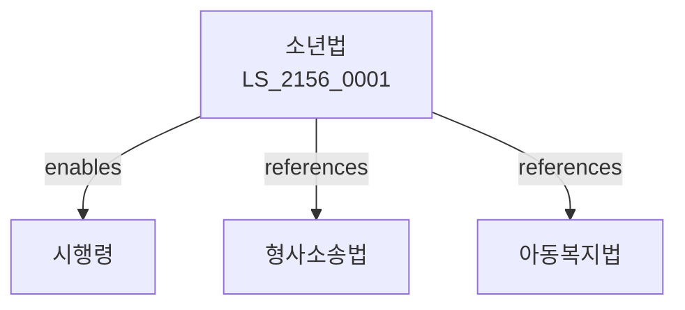

# 소년법

> [법률 제20216호, 2024. 1. 9., 일부개정]

---

---

## 제1장 총칙
### 제1조 (목적)
이 법은 비행소년의 건전한 육성을 도모함으로써 소년의 보호와 사회안전에 이바지함을 목적으로 한다。

### 제2조 (정의)
이 법에서 사용하는 용어의 뜻은 다음과 같다.
1. "소년"란 19세 미만의 자를 말한다.
2. "비행소년"란 범죄소년ㆍ촉법소년 등을 말한다.
3. "보호처분"란 소년을 보호하는 처분을 말한다.
4. "보호자"란 친권자 등을 말한다.

---

## 제2장 비행소년
### 第5条(범죄소년)
범죄를 저지른 소년을 말한다。
### 第6条(촉법소년)
형벌법령에 위반된 행위를 한 10세 이상 14세 미만의 소년을 말한다。
### 第7条(우범소년)
우범성이 있는 소년을 말한다。
### 第8条(보호대상)
보호대상소년을 정한다。

---

## 제3장 보호사건
### 第15条(보호사건)
소년보호사건을 처리한다。
### 第16条(조사)
소년을 조사한다。
### 第17条(심리)
보호사건을 심리한다。
### 第18条(처분)
보호처분을 한다。

---

## 제4장 보호처분
### 第25条(처분종류)
보호처분의 종류를 정한다。
### 第26条(보호관찰)
보호관찰을 할 수 있다。
### 第27条(소년원송치)
소년원에 송치할 수 있다。
### 第28条(수감)
소년교도소에 수감할 수 있다。

---

## 제5장 선도조건
### 第35条(선도조건부)
선도조건부 기소유예를 할 수 있다。
### 第36条(선도명령)
선도명령을 할 수 있다。
### 第37条(보호자책임)
보호자의 책임을 정한다。
### 第38条(보호자교육)
보호자교육을 실시할 수 있다.

---

## 제6장 시설
### 第42条(소년원)
소년원을 설치한다。
### 第43条(소년분류심사원)
소년분류심사원을 설치한다。
### 第44条(소년상담센터)
소년상담센터를 설치한다。
### 第45条(시설운영)
시설을 운영한다。

---

## 제7장 감독
### 第52条(감독)
법무부장관은 소년보호사업을 감독한다。
### 第53条(보고 및 검사)
필요한 경우 보고를 명하거나 검사할 수 있다。
### 第54条(시정명령)
위법한 사항에 대하여는 시정을 명할 수 있다。
### 第55条(조치)
적절한 조치를 취할 수 있다。

---

## 제8장 벌칙
### 第62条(벌칙)
다음 각 호의 어느 하나에 해당하는 자는 2년 이하의 징역 또는 2천만원 이하의 벌금에 처한다。

1. 선도조건을 위반한 자
2. 보호자의무를 위반한 자
### 第63条(과태료)
다음 각 호의 어느 하나에 해당하는 자에게는 1천만원 이하의 과태료를 부과한다。

1. 보고를 하지 아니한 자
2. 검사를 거부한 자

---

## 관계 그래프

**상위 법령**
- [[헌법]] 제10조 (인간의 존엄)
- [[형사소송법]]

**관련 법령**
- [[아동복지법]]
- [[형법]]
- [[형사절차법]]
- [[교육기본법]]

**하위 법령**
- [[소년법 시행령]]
