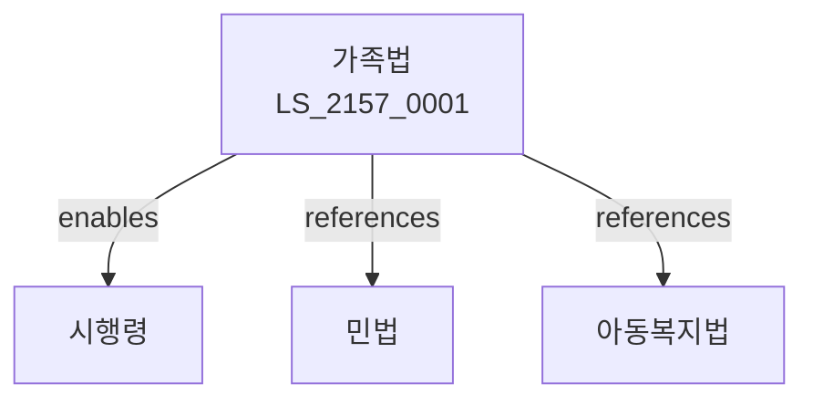

# 가족법

> [법률 제20217호, 2024. 1. 9., 일부개정]

---

---

## 제1장 총칙
### 제1조 (목적)
이 법은 가족관계의 성립과 해소에 관한 사항을 정함으로써 가족의 안정과 복지를 증진함을 목적으로 한다。

### 제2조 (정의)
이 법에서 사용하는 용어의 뜻은 다음과 같다.
1. "가족"란 혈연ㆍ혼인 등으로 구성된 공동체를 말한다.
2. "친족"란 혈족ㆍ인척 등을 말한다.
3. "혼인"란 부부관계를 성립시키는 행위를 말한다.
4. "이혼"란 혼인관계를 해소하는 행위를 말한다.

---

## 제2장 혼인
### 第5条(혼인성립)
혼인은 신고로 성립한다。
### 第6条(혼인적령)
혼인적령을 정한다。
### 第7条(금혼)
혼인을 금지하는 경우를 정한다。
### 第8条(혼인신고)
혼인신고를 하여야 한다。

---

## 제3장 부부
### 第15条(부부의 의무)
부부는 동거ㆍ부양 등의 의무를 진다。
### 第16条(재산관계)
부부재산제를 정한다。
### 第17条(가사채무)
가사채무에 대한 책임을 정한다。
### 第18条(부부평등)
부부는 평등하다。

---

## 제4장 이혼
### 第25条(이혼)
이혼을 할 수 있다。
### 第26条(협의이혼)
협의이혼을 할 수 있다。
### 第27条(재판이혼)
재판이혼을 할 수 있다。
### 第28条(친권)
이혼 후 친권을 정한다。

---

## 제5장 친자
### 第35条(친자관계)
친자관계를 성립한다。
### 第36条(출생신고)
출생신고를 하여야 한다。
### 第37条(인지)
인지를 할 수 있다。
### 第38条(입양)
입양을 할 수 있다。

---

## 제6장 친권
### 第42条(친권자)
친권자를 정한다。
### 第43条(친권행사)
친권을 행사한다。
### 第44条(친권상실)
친권상실을 선고할 수 있다。
### 第45条(후견)
후견인을 선임할 수 있다.

---

## 제7장 가족관계등록
### 第52条(가족관계등록)
가족관계를 등록한다。
### 第53条(등록원부)
가족관계등록원부를 비치한다。
### 第54条(등록사항)
등록사항을 정한다。
### 第55条(정정)
등록사항을 정정할 수 있다。

---

## 제8장 감독
### 第62条(감독)
법무부장관은 가족관계사업을 감독한다。
### 第63条(보고 및 검사)
필요한 경우 보고를 명하거나 검사할 수 있다。
### 第64条(시정명령)
위법한 사항에 대하여는 시정을 명할 수 있다。
### 第65条(과태료)
위반사항에 대하여 과태료를 부과할 수 있다。

---

## 제9장 벌칙
### 第72条(벌칙)
다음 각 호의 어느 하나에 해당하는 자는 3년 이하의 징역 또는 3천만원 이하의 벌금에 처한다。

1. 허위로 혼인신고를 한 자
2. 허위로 출생신고를 한 자
### 第73条(과태료)
다음 각 호의 어느 하나에 해당하는 자에게는 500만원 이하의 과태료를 부과한다。

1. 신고의무를 위반한 자
2. 보고를 하지 아니한 자

---

## 관계 그래프

**상위 법령**
- [[헌법]] 제36조 (혼인과 가족)
- [[민법]]

**관련 법령**
- [[아동복지법]]
- [[한부모가족지원법]]
- [[가정폭력방지법]]
- [[입양특례법]]

**하위 법령**
- [[가족법 시행령]]
