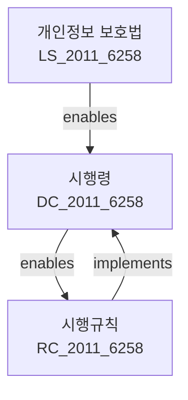
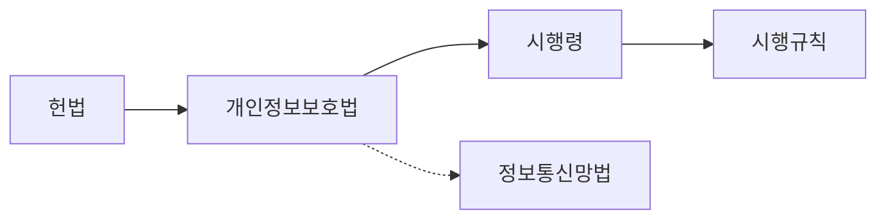

# 개인정보 보호법 시행규칙

> [행정안전부령 제174호, 2011. 11. 30., 제정]

---

**상위 법령**: [[개인정보 보호법 시행령]] (제63조 위임)

---

## 제1장 총칙

### 제1조 (목적)

이 규칙은 「개인정보 보호법」 및 동법 시행령에서 위임된 사항과 그 시행에 필요한 사항을 규정함을 목적으로 한다.

### 제2조 (정의)

이 규칙에서 사용하는 용어의 뜻은 「개인정보 보호법」 및 동법 시행령에서 사용하는 용어의 뜻과 같다.

---

## 제2장 개인정보의 처리

### 제3조 (개인정보처리방침의 공개)

① 「개인정보 보호법」 제30조에 따른 개인정보처리방침에는 다음 각 호의 사항이 포함되어야 한다.

1. 개인정보의 처리 목적
2. 처리하는 개인정보의 항목
3. 개인정보의 처리 및 보유 기간
4. 개인정보의 제3자 제공에 관한 사항
5. 개인정보처리의 위탁에 관한 사항
6. 정보주체의 권리·의무 및 행사방법
7. 개인정보의 파기에 관한 사항
8. 개인정보의 안전성 확보 조치
9. 개인정보 보호책임자의 성명 및 연락처
10. 그 밖에 개인정보의 처리에 관한 사항

② 개인정보처리자는 개인정보처리방침을 공개한 후 1년마다 변경 여부를 확인하여야 한다.

### 제4조 (처리하는 개인정보 항목의 최소화)

개인정보처리자는 처리 목적에 따라 필요한 최소한의 개인정보 항목만을 처리하여야 한다.

### 제5조 (개인정보의 파기)

① 개인정보처리자는 개인정보의 처리 목적이 달성된 때에는 지체 없이 해당 개인정보를 파기하여야 한다.

② 파기 방법은 다음 각 호와 같다.

1. 전자적 형태: 복구할 수 없는 방법으로 영구 삭제
2. 종이 형태: 파쇄 또는 소각

---

## 제3장 개인정보의 안전성 확보

### 제10조 (내부관리계획의 수립)

① 개인정보처리자는 다음 각 호의 사항을 포함한 내부관리계획을 수립하여야 한다.

1. 개인정보 보호 책임자의 지정 및 업무
2. 개인정보의 안전관리 체계
3. 개인정보 취급 직원의 교육
4. 개인정보 처리 시스템의 접근 권한 관리
5. 침해 사고 대응 체계

② 개인정보처리자는 매년 내부관리계획을 점검하고 필요한 경우 개선하여야 한다.

### 제11조 (접근 권한의 관리)

① 개인정보처리자는 개인정보처리시스템에 대한 접근 권한을 직급, 직무 등에 따라 차등 부여하여야 한다.

② 접근 권한을 부여받은 자가 퇴직 또는 직무 변경 시에는 지체 없이 권한을 변경 또는 말소하여야 한다.

### 제12조 (접속기록의 보관)

① 개인정보처리자는 개인정보처리시스템에 대한 접속기록을 다음 각 호의 구분에 따라 보관하여야 한다.

1. 개인정보처리시스템 접속기록: 1년 이상
2. 시스템 운영·관리 기록: 5년 이상

② 접속기록에는 다음 각 호의 사항이 포함되어야 한다.

1. 접속 일시 및 IP 주소
2. 접속자 식별 정보
3. 수행한 업무 내용

---

## 제4장 개인정보 보호책임자

### 제20조 (개인정보 보호책임자의 지정)

① 개인정보처리자는 다음 각 호의 기준에 따라 개인정보 보호책임자를 지정하여야 한다.

1. 공공기관: 2급 이상 공무원 또는 이에 상응하는 직위
2. 정보주체 수 1만 명 이상: 임원급 이상
3. 정보주체 수 1만 명 미만: 팀장급 이상

② 개인정보 보호책임자의 자격요건은 별표 1과 같다.

### 제21조 (개인정보 보호책임자의 업무)

개인정보 보호책임자는 다음 각 호의 업무를 수행한다.

1. 개인정보 보호 계획 수립 및 시행
2. 개인정보 처리 실태 조사 및 개선
3. 개인정보 침해 사고 대응
4. 개인정보 보호 교육 실시
5. 그 밖에 개인정보 보호에 필요한 업무

---

## 제5장 과태료

### 제30조 (과태료의 부과기준)

과태료의 부과기준은 별표 2와 같다.

---

## 별표

| 위반사항 | 과태료 금액 |
|---------|-----------|
| 개인정보처리방침 미공개 | 300만원 |
| 접속기록 미보관 | 200만원 |
| 보호책임자 미지정 | 100만원 |

---

## 관계 그래프

